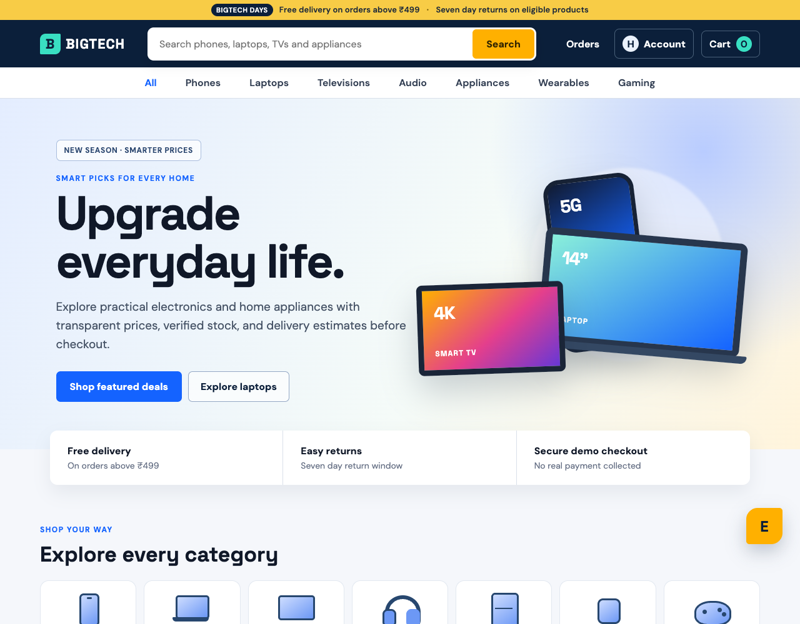
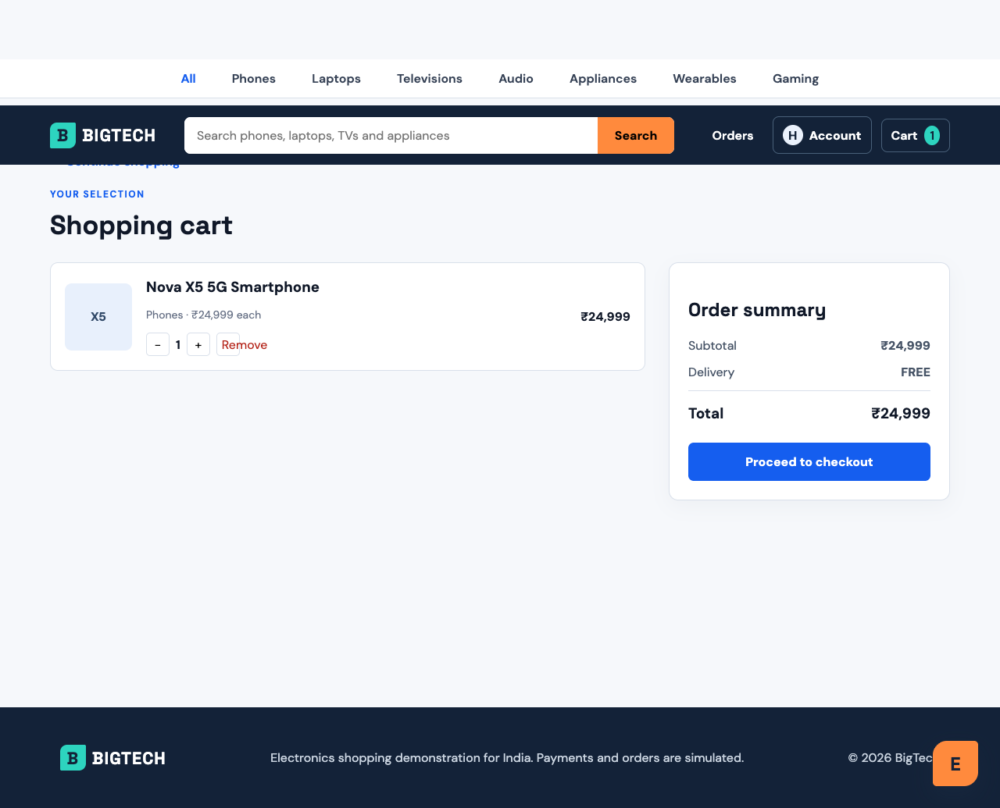
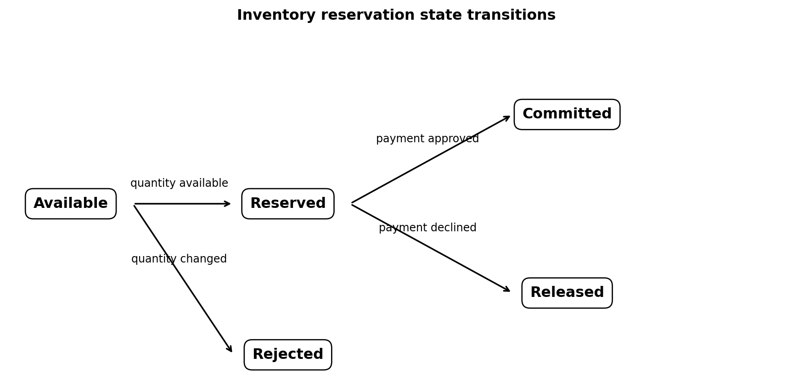
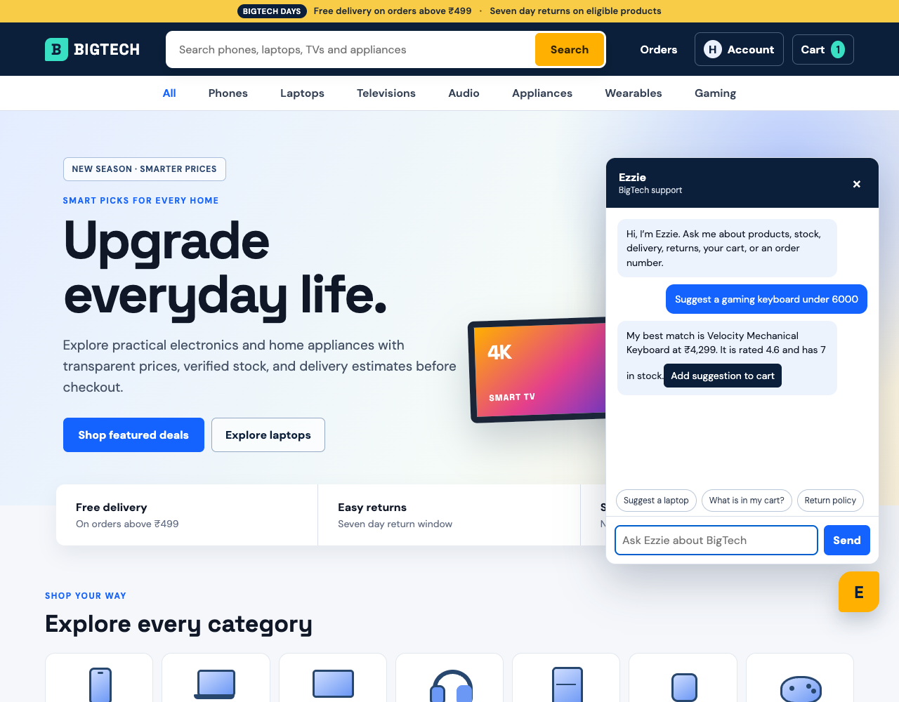

# BigTech Electronics Store

BigTech is an Indian electronics shopping project that connects catalogue discovery, current stock, cart rules, simulated payment, inventory reservation, fulfilment, delivery tracking, order history and Ezzie customer support.

Author: Harika Reddy

[Open the live application](https://bigtech-store.vercel.app/)

<p align="center">
  
</p>

<p align="center"><em>Figure 1. BigTech storefront and catalogue entry point.</em></p>

## Problem, root cause and purpose

A small ecommerce project can look complete while its important business rules remain disconnected. Product cards may show one stock value, checkout may trust another, failed payments may still reduce stock, and a confirmed order may end with an order number instead of explaining what happens before delivery.

The root cause is separate state for catalogue, cart, payment and orders. When those parts do not share one contract, the project cannot prove that it stops safely or preserves inventory.

I built BigTech as one connected electronics order journey. The browser application and Java service follow the same rules for availability, reservation, payment, fulfilment and delivery. The storefront stays customer friendly, while the repository explains and tests the internal coordination.

## Verified result

| Measure | Result |
| --- | ---: |
| Catalogue | 28 electronics and appliance products |
| Categories | 7 |
| Customer delivery stages | 8 |
| Checkout outcomes | 3 |
| JavaScript tests | 10 passed |
| Java tests | 4 passed |
| Total automated tests | 14 passed |

The catalogue is intentionally bounded because this project evaluates software behavior rather than statistical learning. The test data includes available, low stock and unavailable products, plus confirmed, shipped, out for delivery, delivered, payment failed and stock changed orders.

## Customer experience

Customers can complete the following journey.

1. Search, filter and sort phones, laptops, televisions, audio, appliances, wearables and gaming products.
2. Review Indian rupee prices, ratings, discount, current stock and cart quantity limits.
3. Ask Ezzie for a product within a category or budget and add the suggestion to the cart.
4. Enter an Indian delivery address and choose a controlled successful payment, failed payment or stock changed outcome.
5. Receive a saved order reference for every success or failure branch.
6. Open an order to follow received, reserved, paid, picking, packed, shipped, out for delivery and delivered stages.
7. Review the before, held and after inventory quantity for every ordered item.
8. Inspect recent activity and catalogue availability from the account area.

<p align="center">
  
</p>

<p align="center"><em>Figure 2. Cart validation and reproducible checkout outcomes.</em></p>

## Inventory safeguards

BigTech models inventory as a reservation rather than subtracting stock before payment is known.

| Checkout branch | Inventory transition | Result |
| --- | --- | --- |
| Payment succeeds | Available to reserved to committed | Available stock decreases and delivery begins |
| Payment fails | Available to reserved to released | Stock returns to the previous value and delivery does not begin |
| Stock changes | Available to rejected | Payment is skipped and the failed attempt is saved |

Successful browser orders persist the new stock value in versioned local storage. A failed payment preserves the cart and releases the stock hold. A forced stock conflict marks the product unavailable in that browser, prevents payment and keeps the evidence visible in My orders.

<p align="center">
  
</p>

<p align="center"><em>Figure 3. Inventory is committed, released or rejected according to the checkout result.</em></p>

## Multi agent order coordination

The Spring Boot backend contains five bounded agents coordinated by `OrderCoordinator`.

1. Inventory Agent validates the requested quantity and creates a reservation.
2. Payment Agent approves or declines the chosen simulation.
3. Fulfilment Agent calculates the delivery date and plans picking and packing.
4. Delivery Agent creates the customer milestone sequence.
5. Notification Agent records the final customer update.

The agents are deterministic Java components. They do not use a language model. This keeps each responsibility testable and makes failure recovery explicit. Agent names and workflow steps stay in the source and technical documentation; customers see normal order and delivery language.

### Responsibility handoff

| Order phase | Responsible component | Inventory effect | Customer evidence |
| --- | --- | --- | --- |
| Request accepted | Order Coordinator | No quantity change | Order received |
| Availability check | Inventory Agent | Available units become reserved | Items reserved |
| Payment | Payment Agent | Reservation is committed or released | Payment confirmed or declined |
| Preparation | Fulfilment Agent | Committed stock belongs to the order | Picking and packed |
| Transport | Delivery Agent | No further stock change | Shipped, out for delivery and delivered |
| Final update | Notification Agent | Final result is recorded | My orders and Ezzie lookup |

<p align="center">
  
</p>

<p align="center"><em>Figure 4. A confirmed order moves through eight customer visible delivery stages.</em></p>

## Ezzie support

Ezzie is a website scoped conversational support layer. It can recommend an in stock product within a budget, explain the cart, stock, payment, delivery and return rules, and look up a saved BigTech order number. Order answers use the same stored order timeline shown on the order page.

Requests outside the BigTech website receive a short scope response. Ezzie is deterministic and does not send customer messages to an external model.

<p align="center">
  
</p>

<p align="center"><em>Figure 5. Ezzie uses catalogue and saved order data for support.</em></p>

## Backend and application architecture

The public application uses HTML, CSS and JavaScript modules. Versioned browser storage keeps the cart, personal orders and inventory changes on the visitor's device. This allows the public Vercel deployment to work without collecting personal data.

The Java 17 Spring Boot service provides a separately testable `POST /api/orders` contract. It validates input, reserves stock, coordinates payment, releases or commits inventory, schedules fulfilment and returns typed workflow and delivery evidence.

### Backend service map

| Backend area | Java implementation | Verified behaviour |
| --- | --- | --- |
| REST boundary | `OrderController` and request records | Invalid or incomplete order input is rejected before orchestration |
| Coordination | `OrderCoordinator` | Required steps run in dependency order and later work stops after failure |
| Inventory | `InventoryAgent` and inventory service | All lines reserve together, then commit, release or reject |
| Payment | `PaymentAgent` | Approval continues the order; decline releases stock and creates no delivery |
| Fulfilment | `FulfilmentAgent` | Confirmed items receive picking, packing and estimated delivery data |
| Delivery | `DeliveryAgent` | Eight typed customer milestones are returned in order |
| Notification | `NotificationAgent` | Every branch receives a final recorded outcome |
| Backend tests | Maven and JUnit | Four scenarios verify commit, release, rejection and delivery behaviour |

The backend response contains the final order status, workflow trace, inventory snapshot and customer timeline. The browser saves that response for order details and Ezzie lookup instead of rebuilding backend state from display text.

```text
Customer interface
      |
      v
Catalogue and cart state
      |
      v
Order Coordinator
      |
      +--> Inventory Agent --> reserve, reject, release or commit
      +--> Payment Agent --> approve or decline
      +--> Fulfilment Agent --> picking, packing and estimate
      +--> Delivery Agent --> eight customer milestones
      +--> Notification Agent --> saved outcome
```

Detailed contracts and failure sequences are documented in [architecture notes](docs/architecture.md).

## Repository guide

| Path | Contents |
| --- | --- |
| `public` | Storefront, catalogue, account, cart, checkout, orders and Ezzie |
| `backend` | Spring Boot order service, agents, state transitions and JUnit tests |
| `tests` | JavaScript business rule tests |
| `scripts/verify_browser.mjs` | Browser journey verification and evidence capture |
| `evidence` | Storefront, checkout, order and assistant screenshots |
| `reports` | Detailed PDF project report and experiment figures |
| `docs/architecture.md` | Components, contracts and failure paths |

## Run and verify

Storefront:

```bash
npm install
npm run serve
```

Open `http://localhost:3000`.

Java service:

```bash
cd backend
./mvnw test
./mvnw spring-boot:run
```

Automated tests:

```bash
npm test
cd backend && ./mvnw test
```

## Limitations

1. Products, stock, payment results, customers, orders and delivery events are synthetic.
2. No real payment, warehouse or courier service is connected.
3. Browser state is personal to one visitor and is not shared inventory.
4. The public static application does not call the local Java service.
5. Ezzie uses declared rules rather than an open ended language model.

## Project report

The [project report](reports/BigTech_Report.pdf) follows the customer journey from catalogue and cart through reservation, payment, fulfilment, delivery, failure recovery and test results.
