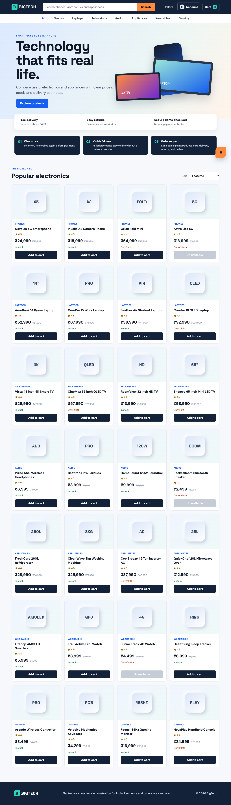

# BigTech Electronics Store

BigTech is a responsive Indian electronics shopping project that connects product discovery, stock-aware cart behaviour, simulated checkout, payment outcomes, order history, delivery estimates, an account area, and Ezzie customer support.

[Open the live website](https://bigtech-electronics-store.vercel.app/)



## Project question

Can a compact student project demonstrate the connected business rules behind an ecommerce journey instead of stopping at a product grid?

## Customer experience

The catalogue contains 28 products across phones, laptops, televisions, audio, appliances, wearables, and gaming. Customers can search, filter, sort, see stock conditions, manage quantities, calculate delivery, simulate successful or failed payment, receive an order number, review orders, and use a profile area.

Ezzie answers questions limited to BigTech. It can recommend an in-stock product within a budget, understand category words such as laptop, television, smartwatch, or gaming, describe the cart, explain delivery and returns, and look up saved demo order numbers.

## Business rules

| Situation | Result |
| --- | --- |
| Product has no stock | Add button is disabled |
| Cart exceeds available quantity | Quantity increase is blocked |
| Stock changes before payment | Checkout returns `STOCK_CHANGED` |
| Payment simulation fails | Failed order is saved without a delivery date |
| Payment succeeds | Confirmed order receives an order number and estimate |
| Unrelated Ezzie request | Assistant keeps a website-only scope |

## Technical design

The browser application is written with HTML, CSS, and JavaScript modules. Cart and orders are kept in browser storage so the deployed demonstration works without collecting personal data.

The Java Spring Boot service implements request validation and an order coordination sequence across inventory, payment, and fulfilment services. JUnit verifies successful orders, stock rejection, and failed payment behaviour. Frontend tests verify cart calculations, stock, payment, Ezzie scope, recommendations, and catalogue coverage.

## Repository guide

| Path | Contents |
| --- | --- |
| `public` | Responsive storefront, catalogue, account, cart, checkout, orders, and Ezzie |
| `backend` | Spring Boot order API and service tests |
| `tests` | JavaScript business-rule tests |
| `scripts/verify_browser.mjs` | Browser journey verification and evidence capture |
| `evidence` | Storefront, checkout, and assistant screenshots |
| `reports` | Detailed PDF project report |
| `docs/architecture.md` | Component and request-flow notes |

[Read the ten page project report](reports/BigTech_Electronics_Store_Report.pdf)

## Run the website

```bash
npm install
npm run serve
```

Open `http://localhost:3000`.

## Run the Java service

```bash
cd backend
./mvnw test
./mvnw spring-boot:run
```

The service runs at `http://localhost:8080`.

## Test

```bash
npm test
cd backend && ./mvnw test
```

Payments, stock, customer details, orders, and delivery dates are simulated. No real payment is collected and no commercial order is created.

## Author

Harika
